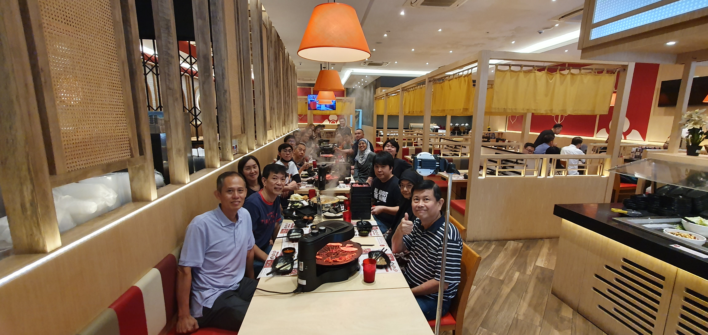

<html lang="en">
    <head>
        

                    <h1>SG FPE TEAM</h1>
        <link rel="stylesheet" type="text/css" href="css/style1.css">
    </head>
    <body background="SGFPE.github.io/CIMG0750.jpg">
        <header>
            

                

                    
                

                <ul>
                <li class="active"><a href="//16.80.204.133/pe/index.html" target="_blank">Home</a></li>
                </ul>
            

                

                    <h1>FY23 Q1 RnR!</h1>
                

                

                    <a href="#" class="btn"><a href="https://hpe-my.sharepoint.com/personal/chee_hpe_com1/_layouts/15/onedrive.aspx?id=%2Fpersonal%2Fchee%5Fhpe%5Fcom1%2FDocuments%2FR%26R%2016%20Feb%202023&ga=1" target="_blank"> LEARN MORE</a>
                

        </header>
             
             
         
            

                <h1 class="us">MESSAGE TO THE TEAM</h1>
                 
                 
                
Hi all, thank you everyone for attending FY23 Q1 RnR! Do check out the link below to see if your moment is being captured, 
                 hope the time spent with us was a pleasant one.
                 
                 
                 
                 
                 
                                    
                 Regards, 
                 Q1 RnR Planning Team 

            

             
             
        <h1 style="text-decoration-color: aqua;">Photo gallery</h1>
         
         
           

  

  

         
         
         

  

        
 © 2023 All Rights Reserved <a href="mailto:ap.fpe@hpe.com" target="_blank">EMAP Product Engineering</a>

    
    
    </body>
</html>
